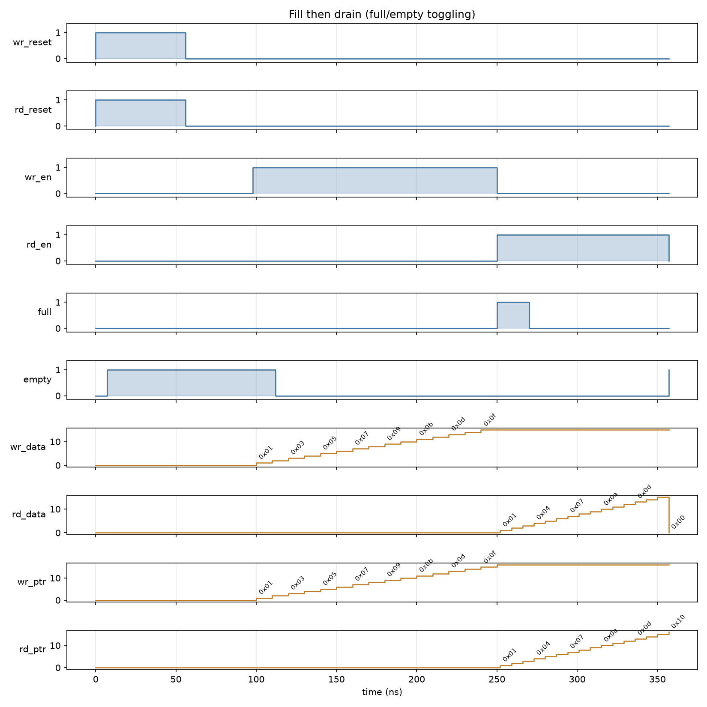
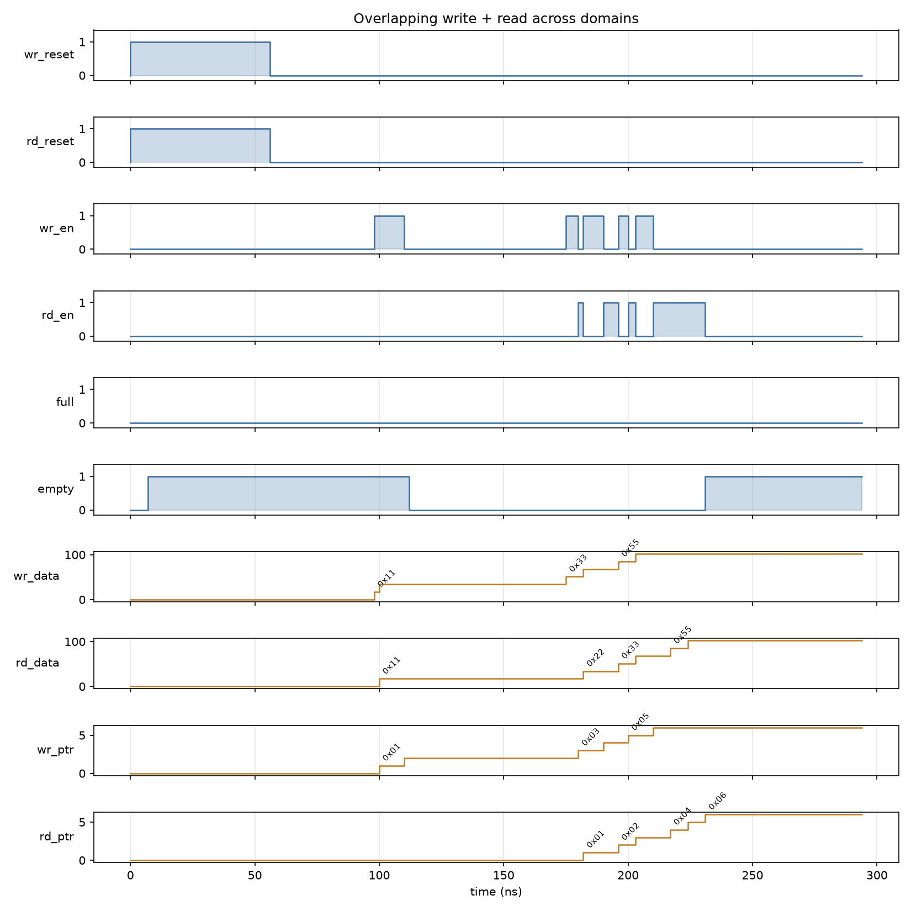
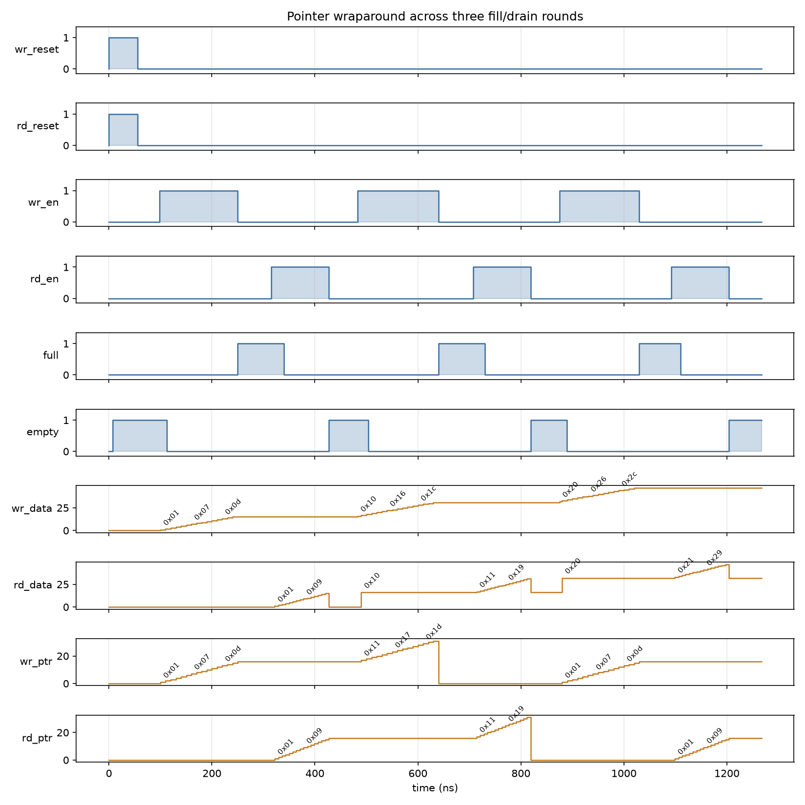

# Asynchronous FIFO with AXI4-Stream

The RTL and its logic here are hand-written by me. AI assistance filled in the rest of the test coverage.

This is a dual-clock (asynchronous) FIFO with an AXI4-Stream wrapper on top of it, with the write and read sides running on independent clocks.

## What's in here

`rtl/Async_FIFO.sv` is the actual FIFO: a circular buffer with separate write and read pointers, one bit wider than needed to address the memory so wrapping the pointer around lets `full` and `empty` be told apart with simple pointer comparisons instead of a separate counter. Pointers are Gray-coded and synchronized across the `wr_clk`/`rd_clk` boundary with 2-flop synchronizers, and each domain resets independently. `DATA_WIDTH` and `DEPTH` are both parameters.

`rtl/async_FIFO_axi_stream.sv` wraps the FIFO in an AXI4-Stream slave/master interface — `s_axis_tvalid`/`s_axis_tready` on the write side, `m_axis_tvalid`/`m_axis_tready` on the read side — so `wr_en`/`rd_en` just become the AND of valid and ready on each side.

`sim/test_async_fifo.py` is the cocotb testbench. It covers reset behavior, basic write/read, filling and draining, gapless back-to-back writes and reads, overlapping writes and reads on independent clocks, pointer wraparound, and what happens if you assert `wr_en` while full or `rd_en` while empty (spoiler: nothing stops you, and it'll quietly corrupt data — there's no overflow/underflow protection in this design, so that's on whatever's driving it).

`sim/generate_waveforms.sh` runs a few of those tests in isolation with waveform dumping on and renders the signals to PNGs under `docs/waveforms/` via `sim/render_waveforms.py`.

## Simulation

I'm using cocotb with Icarus Verilog for simulation. `cd sim && make` runs the full test suite.

```
cd sim
python3 -m venv .venv && source .venv/bin/activate
pip install -r requirements.txt
make
```

## Waveforms

**Fill then drain** — gapless writes until full, then gapless reads until empty, each on its own clock. `full` and `empty` each pulse for exactly one cycle at the transition points, and the write/read pointers count straight up without resetting.



**Overlapping write + read** — once the FIFO has a couple of entries in it, writes on `wr_clk` and reads on `rd_clk` happen concurrently instead of in lockstep, and the data still comes out in the order it went in.



**Pointer wraparound** — three full fill/drain rounds back to back, enough for both pointers to wrap past the top of the buffer twice. Data stays consistent across the wrap, which is the whole point of using a pointer MSB instead of a separate counter for the full/empty logic.



## Repo layout

- `rtl/` — the FIFO and its AXI4-Stream wrapper
- `sim/` — cocotb testbench, waveform script, and the Makefile that drives Icarus Verilog
- `docs/waveforms/` — rendered waveform PNGs
